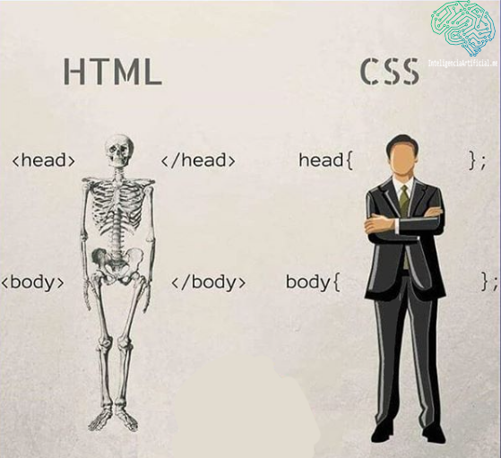

# Tu página personal #

## Introducción ##

Este será tu primer proyecto, donde crearás tu página personal con tecnologías HTML y CSS

## Objetivos ##

Crear una página únicamente con tecnologías HTML y CSS.

Constará de la siguientes páginas:

- Página de bienvenida

- Tu biografía

- Ejemplos de tu trabajo

- Información de contacto

## Requisitos ##

- HTML5

- CSS3

## Iteraciones ##

### HTML5 ###

1. Página de bienvenida

    Es la segunda página de tu proyecto y será aquella que se verá primero. Esta será la página `index.html`.

    Una vez creadas las páginas `index.html` y `biografia.html`, tendrás que crear el menú de navegación que incluirás en ambas páginas.

2. Información de contacto

    Nueva página, de nombre `contacto.html`, en la que incluir un formulario de contacto y el menú de navegación.

3. Etiquetas semánticas HTML5

    En este apartado habrás de hacer una revisión de las 3 páginas creadas y agregar todas las etiquetas semánticas posibles.

### CSS3 ###

1. Tipografía personalizada

    Agregarás tu primera adición estética, usando una fuente personalizada en tu página.

    Sigue las instrucciones en [W3Schools](https://www.w3schools.com/howto/howto_google_fonts.asp) para aprender cómo se hace, y [Google Fonts](https://fonts.google.com) como ejemplo de página donde poder encontrar una tipografía adecuada.

2. Selectores

    Uso adecuado de selectores CSS con lo visto en clase: `element, id, class, selectores compuestos, etc...`

2. Modelo de cajas CSS

    Es tiempo de usar `margin, padding, border` a tu página según convenga.

3. Efectos

    Utiliza pseudoclases: `Hover,focus, etc...` para dar un poco de dinamismo a la página

    Juega con `display/visibility` en conjunto con las pseudoclases donde haga falta 

### Sube a GitHub tu proyecto! (para Fullstack) ###

1. Crear un repositorio en Github para la página de tu biografía.

    1.1 Crear un repositorio para el nuevo proyecto

    1.2 Una vez hecho esto, crea la página de tu biografía o presentación. Llámala `biografia.html` Aplica todo lo aprendido sobre marcado de texto y formato.

    1.3 Sube tu proyecto a Github.
    
    1.4 Una vez en tu repositorio (en el navegador) ve a **Settings -> Github Pages** y en **Source** cambia la opción de **none** a **main**

[Aquí encontrarás una lista de links a recursos que podrían servirte](usefulLinks.md)

### Y lo más importante. Diviértete y tira de imaginación ###

Cualquier otro extra que se te ocurra será bienvenida :blush: ¡A por ello!

